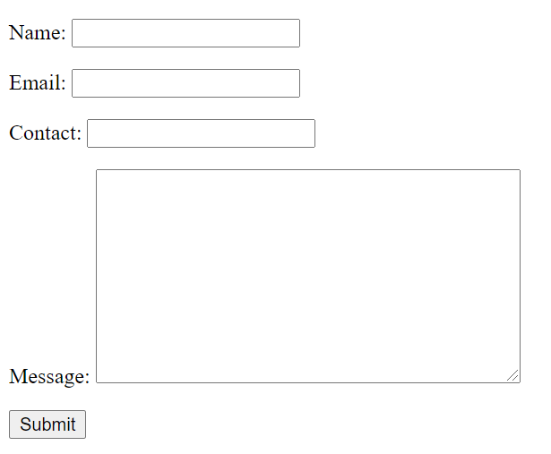
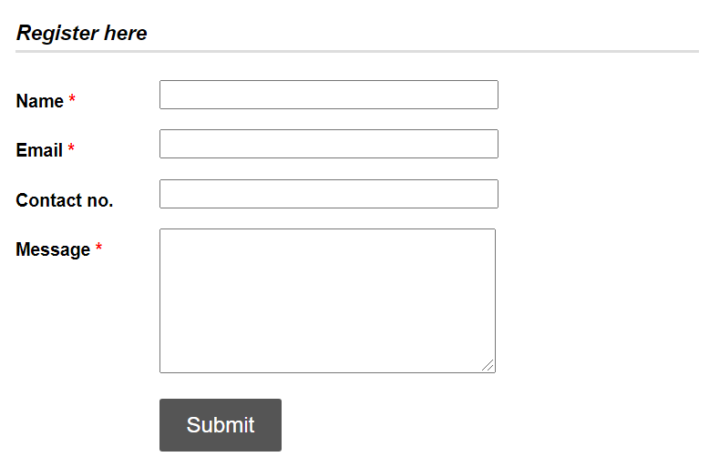

## How to manually render forms in Django

Let us first know how Django actually renders forms.

Django handles three distinct parts of the work involved in forms:
* Preparing and restructuring data to make it ready for rendering
* Creating HTML forms for the data
* Receiving and processing submitted forms and data from the client


*Django can take care of it all for you*

### Form rendering options: 

**{{ form.as_table }}** will render field as table cells wrapped in < tr > tags
  
**{{ form.as_p }}** will render fields wrapped in < p > tags
  
**{{ form.as_ul }}** will render fields wrapped in < li > tags
  
Here where we are using **{{ form.as_p }}** to render a form:
```html
<div>
 <form method="post">
    
    {{ form.as_p }}
    <input type="submit" value="Submit">
 </form> 
</div>
```
Django renders it like this:



*Not so beautiful right! So let's see how we can beautify it with CSS.*

This repo contains the code for manually rendering the form below and adding CSS in it:



For more information checkout this <a href="">article</a>.

